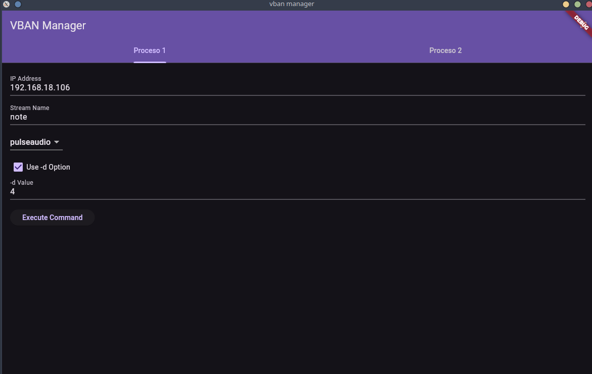

# VBAN Manager



VBAN Manager es una aplicación Flutter diseñada para gestionar configuraciones de VBAN (Voice over IP, Audio over Network) y ejecutar comandos relacionados con VBAN en un entorno gráfico. La aplicación permite configurar y ejecutar comandos VBAN en múltiples procesos y guardar estas configuraciones usando `SharedPreferences`.

## Características

- Interfaz gráfica amigable con soporte para tema oscuro.
- Gestión de dos procesos VBAN diferentes con pestañas dedicadas.
- Guardado automático de configuraciones usando `SharedPreferences`.
- Ejecución de comandos VBAN en el backend con la posibilidad de detener todos los procesos activos.

## Tecnologías Utilizadas

- [Flutter](https://flutter.dev/)
- [SharedPreferences](https://pub.dev/packages/shared_preferences)
- [Dart](https://dart.dev/)

## Requisitos Previos

Asegúrate de tener instalado Flutter en tu máquina. Puedes seguir las instrucciones de la [documentación oficial de Flutter](https://flutter.dev/docs/get-started/install) para instalarlo.

Además, VBAN Manager requiere que `vban_emitter` esté instalado y disponible en tu entorno.

## Instalación

1. Clona el repositorio:
          ```sh
          git clone https://github.com/gladoncio/Vban_flutter_manager
          ```
2. Navega al directorio del proyecto:
          ```sh
          cd Vban_flutter_manager
          ```
3. Instala las dependencias:
          ```sh
          flutter pub get
          ```

## Ejecución

Para ejecutar la aplicación en modo debug, utiliza el siguiente comando:
```sh
flutter run
```